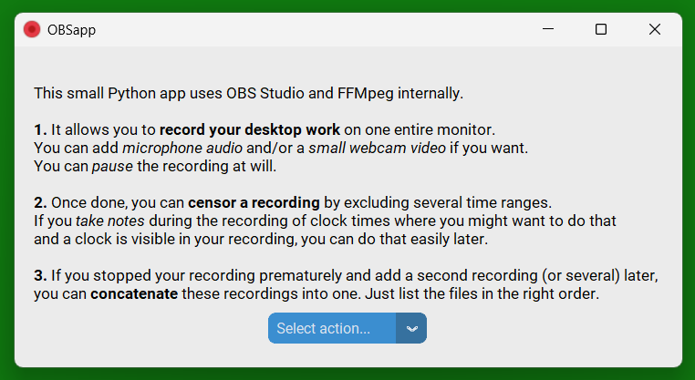
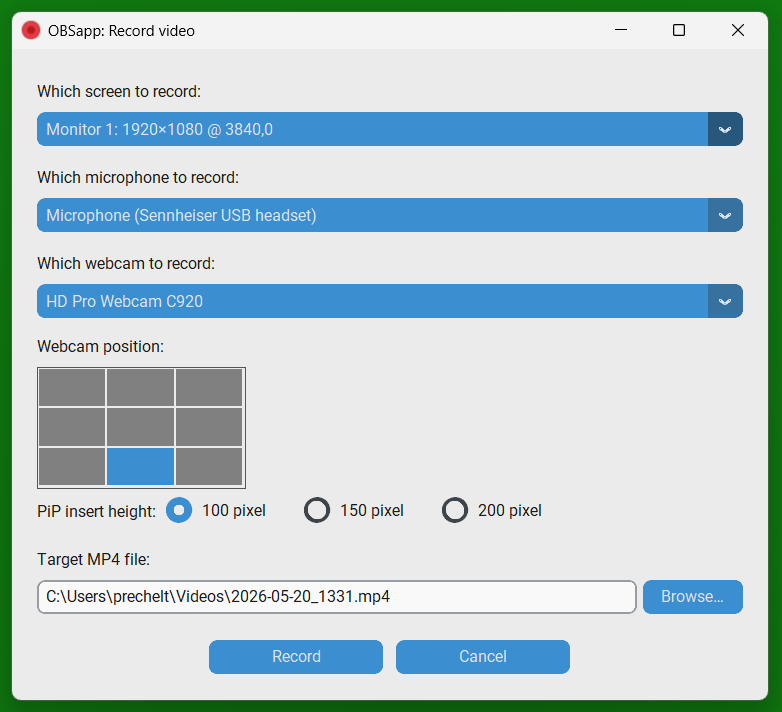
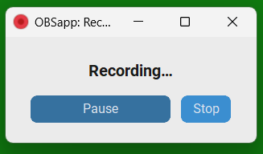
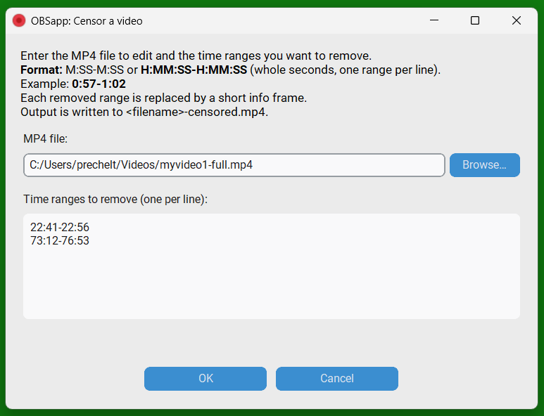
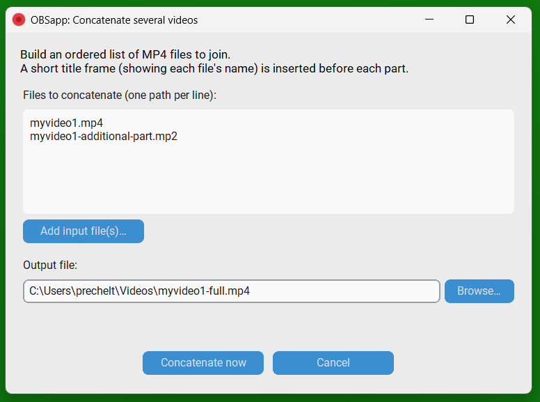

# OBS Appliance (OBSapp)

A few-click appliance to easily screen-record your desktop work locally with Open Broadcaster Software (OBS).
Records one screen and optionally audio and webcam video.
We use recent versions of OBS (V.30 or younger).

Still in early development and not ready for use.

## 1. Screenshots

### 1.1 Home



### 1.2 Record



If you record webcam video, it will be laid over the desktop recording in PiP (picture in picture) fashion.
Put it in an area on the screen where you rarely expect important things to happen. 



You can pause and resume the video at any time, e.g., when you are about to do something
you do not want to appear in the video (e.g. read your email).

### 1.3 Censor video

If you forgot to pause the recording and have recorded something private,
you can cut it out after the fact: Find suitable from--to timestamps and enter them
in the "censor" dialog.

If a clock is visible in the recording, this becomees a lot easier if you manage to note down the 
wall clock time during the recording.



### 1.4 Concatenate videos

If your session has a second (third, fourth) part after the recording,
you can record this separately and then join the recordings via the "concatenate" dialog:




## 2. Installation

Although OBS Appliance is based on Python, 
installation is always directly from GitHub.
There is no PyPI package because the standard install processes of those do not fit well
with the dependency management that our shell-script installer performs.

### 2.1 Installation on Windows

Create an empty directory anywhere you like (e.g. in your home directory).
Change into it.
Then call
```powershell
& ([scriptblock]::Create((Invoke-RestMethod 'https://raw.githubusercontent.com/prechelt/obsappliance/main/installer/install.ps1'))) -InstallDir .
```

Downloads OBS Studio, FFmpeg, and Python into that directory
(unless suitable versions are found in their usual locations),
then installs OBSapp and creates a desktop shortcut.
A launcher is written into the install directory as `run-obsapp.bat`.
No administrator rights required.

To uninstall, simply delete the entire installation directory and the desktop shortcut.

### 2.2 Installation on macOS

NOT YET AVAILABLE.

[Homebrew](https://brew.sh) 
must be installed first.

```bash
bash installer/install.sh
```

Installs OBS Studio, FFmpeg, and Python via Homebrew (no sudo needed), or,
if suitable versions are found in the PATH, uses those.

Installs OBSapp into `~/.local/share/obsapp/venv` and !!!. 
A launcher is placed at `~/.local/bin/obsapp` and a shortcut at `~/Desktop/OBSapp.app`.

### 2.3 Installation on Linux

```bash
curl -fsSL https://raw.githubusercontent.com/prechelt/obsappliance/main/installer/install.sh | bash
```

Installs OBS Studio and FFmpeg via the system package manager
(apt / dnf / pacman / zypper) if they do not yet exist; `sudo` is required for that step.
OBSapp goes into `~/.local/share/obsapp/venv`.
A launcher is placed at `~/.local/bin/obsapp` and a desktop entry at
`~/.local/share/applications/obsapp.desktop`.

To uninstall, simply delete these two files and the `~/.local/share/obsapp` directory.

### 2.4 Updating OBSapp

Re-run the same install command. 
OBS Studio, FFmpeg, and system packages are left untouched; only OBSapp is reinstalled.  

To install from the `main` branch instead of the latest release, 
add `--current` (Linux/macOS) or `-Current` (Windows).

### 2.5 Release Notes

The installer will always install the newest version;
there are no formal release files yet.

For development history, see [docs/changelog.md](docs/changelog.md).


## 3. Architecture


### 3.1 Base Technology

- **Installation** is via bootstrap scripts `install.sh` for Linux/macOS and `install.ps1` for Windows.
- **obsappliance** is a small Python application with a desktop GUI that glues together the
  powerful capabilities of OBS Studio (video recording) and FFmpeg (video file handling).
- **OBS Studio** — used as the recording engine (screen capture, mic/webcam input,
  hardware encoder detection, pause/resume). Requires OBS V28 or newer.
- **FFmpeg** — used for video editing (censor, concatenate, text-frame generation).
- **CustomTkinter** — Python GUI toolkit providing a modern look on all platforms.
- **obs-websocket** — built into OBS 28+, used for all runtime control
  (`StartRecord`, `StopRecord`, `PauseRecord`, `ResumeRecord`, `GetInputList`, etc.)
  via the `obsws-python` library. Runs on `localhost:4455` with no password.

### 3.2 Modules

- **`main.py`** — Entry point and top-level `App` (CustomTkinter window).
  Owns the frame-switching lifecycle and starts/stops OBS on demand.

- **`api.py`** — High-level, GUI-free API (`Session` class) that orchestrates
  recording, censoring, and concatenation; used by both the GUI dialogs and the
  integration test.

- **`obs_control.py`** — Manages the OBS Studio process (launch, shutdown) and
  issues all websocket commands (start/pause/resume/stop record, source setup).

- **`video_ops.py`** — All FFmpeg work: probing video metadata, censoring ranges
  (cut-and-replace with a text frame), and concatenating files with title slides.

- **`config.py`** — Persists the record-dialog defaults (monitor, mic, webcam,
  output path) as a JSON file so the next session starts with sensible values.

- **`os_specifics.py`** — Enumerates monitors, microphones, and webcams via
  native OS APIs (Win32 COM/ctypes, Linux xrandr/pactl, macOS system_profiler).

- **`gui/*.py`** — One `CTkFrame` subclass per screen (main menu, record dialog,
  censor dialog, concatenate dialog) plus shared widget helpers.
  All geometry is specified in *logical* pixels (as CustomTkinter and `geometry()`
  expect), but `winfo_reqwidth/height()` and `font.measure()` return *physical*
  pixels on HiDPI displays; every such value must be divided by
  `app._get_window_scaling()` before being passed to `geometry()` or `minsize()`.

### 3.3 Configuration

OBSappliance's `main.py` is called with a single argument, an `.ini` config file.
Its directory is the obsapp directory.
The OBS config files that obsapp creates dynamically will live in it.
Python, the Python venv, OBS Studio, and FFmpeg may live in that directory or elsewhere.
Here is an example how it may look in an installed version of obsapp on Windows:
```ini
[obsappliance]
obs_executable=C:\Tools\obsapp\obs-studio\bin\64bit\obs64.exe
ffmpeg_executable=C:\Tools\obsapp\ffmpeg\bin\ffmpeg.exe
venv_dir=C:\Tools\obsapp\venv
# The obs_config_dir will be the 'obs-config' subdirectory of the present file's location.
```
When obsapp starts, it immediately changes into the obsapp directory, so that the config file
can use relative paths, so that the obsapp directory can be relocated easily.

Here is a manually created variant for a development setup on Windows where all parts are in a standard place:
```ini
[obsappliance]
obs_executable=c:\Program Files\obs-studio\bin\64bit\obs64.exe
ffmpeg_executable=C:\sw\ffmpeg20260323\bin\ffmpeg.exe
venv_dir=c:\venvs\obsapp
# The obs_config_dir will be the 'obs-config' subdirectory of the present file's location.
```


## 4. FAQ

### 4.1 Can I record multiple screens at once?

No, this is not possible with OBSapp.

### 4.2 Linux: My webcam is not offered for selection

This can happen if you are not a member of the `video` group.
Check it with `groups`. Add yourself by `sudo usermod -aG video yourusername`.

### 4.3 Wayland: Why does another screen selection dialog appear when I finish the OBSapp recording dialog?

To the best of our knowledge, this is unavoidable, because `pipewire-desktop-capture` does not 
accept a pre-selected screen ID.


## 5. Development steps

At the moment, this is only for me and may not fit your setup at all.

### 5.1 On Dhaka: Initialize development

In our development so far, OBSappliance runs on Windows, so it needs a
Windows venv. 
Therefore, we initialize development from a `pwsh`:
```
cd c:/ws/gh/obsappliance
c:\venv\obsapp\Scripts\Activate.ps1
```

### 5.2 Start agentic work

`\sw\opencode\opencode` while in `pwsh` (or `/c/sw/opencode/opencode` while in `bash`).

### 5.3 Interactive testing

On Windows:
```
& 'C:\Program Files\Git\bin\bash.exe'
PYTHONPATH=src python -m obsapp.main tmp_obsappdir/obsapp-config.ini
```

On Linux:
```
PYTHONPATH=src DISPLAY=":0" python -m obsapp.main tmp_obsappdir/obsapp-config.ini
```

### 5.4 Steps to do

- _make_text_frame(): make the font scaling work, it currently does not scale down long filenames.
- Port to Linux
- Port to macOS


### 6. Next development step

- ...

